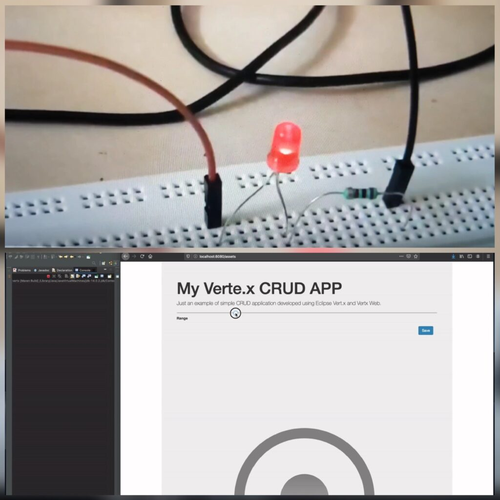

## Vert.x Potentiometer web Starter example

This project is a Vert.X web Example CRUD App with REST endpoints to use as a Potentiometer.

## Running the Project

'''
mvn compile vertex:run
'''

## Building the project

'''
mvn clean package
'''

It generates a SNAPSHO.jar_ in the `target` directory.

You can view the result in localhost:8080/assests/ url

- [Blog post](http://www.igfasouza.com/blog/raspberry-pi-vert-x-web-potentiometer/)
